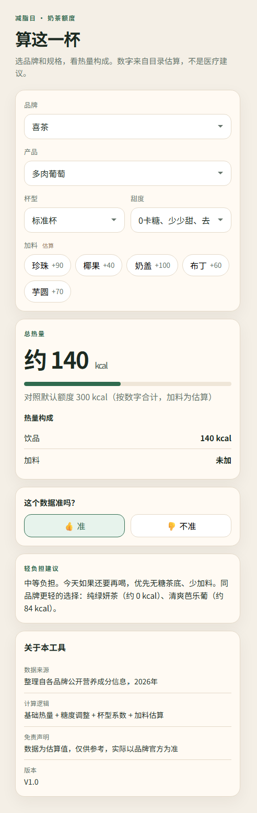

# 奶茶热量追踪

一个帮你快速估算奶茶热量的小工具。选好品牌、产品、杯型、糖度和加料，就能看到这杯大概多少卡，以及热量是怎么构成的。

线上地址：https://milk-tea-calorie-tracker.vercel.app/
代码仓库：https://github.com/angela4427/milk-tea-calorie-tracker

## 功能

- 选择品牌、产品、杯型、糖度、加料（加料可多选）
- 实时计算总热量，并拆分展示构成（饮品基础热量 + 加料估算）
- 对照默认额度给出轻负担建议，并推荐同品牌热量更低的选项
- 某款产品缺少精确数据时，显示「暂无精确数据，仅供参考」
- 结果下方有反馈按钮（👍 准 / 👎 不准），记录在本机

## 数据规模

| 项目 | 数量 |
| --- | --- |
| 品牌 | 10 |
| 产品 | 100（每个品牌 10 款） |
| 糖度档位 | 238 |

覆盖品牌：喜茶、奈雪的茶、蜜雪冰城、一点点、CoCo都可、茶百道、霸王茶姬、古茗、沪上阿姨、书亦烧仙草。

## 数据说明

- **来源**：品牌官方小程序、外卖平台菜单、公开营养信息。
- **筛选**：已删除确认下架的产品和季节限定款；区域限定、部分门店在售的产品会在 `note` 字段标注。
- **准确性**：热量为估算值，仅供参考。实际以门店和品牌官方数据为准。

数据维护在 `src/data/drinks.json`，单条记录的结构：

```json
{
  "brand": "蜜雪冰城",
  "product": "蜜桃四季春",
  "cupSize": "标准杯",
  "sugarOptions": [
    { "sugar": "无糖", "calories": 60, "caloriesText": "≈60" },
    { "sugar": "三分糖", "calories": 100, "caloriesText": "≈100" }
  ],
  "note": "估算值，仅供参考"
}
```

`calories` 为 `null` 表示暂无精确数据，页面会给出对应提示。

## 技术栈

- Vue 3 + TypeScript
- Vite
- 数据以 JSON 本地维护，无后端
- 部署在 Vercel

## 本地运行

需要 Node.js。

```bash
npm install
npm run dev
```

打开终端提示的地址，默认是 http://localhost:5173/。端口被占用时 Vite 会自动换一个。

构建和本地预览生产版本：

```bash
npm run build
npm run preview
```

## 线上链接

https://milk-tea-calorie-tracker.vercel.app/

## V1 原型

墨刀界面稿存档在 [`docs/prototype/`](./docs/prototype/)。

推荐直接看截图：



更完整的说明见 [`docs/prototype/README.md`](./docs/prototype/README.md)。

## 迭代计划

V2 计划接入 AI API（扣子），支持自然语言查询，不用逐项下拉选择。比如直接问「一杯一点点珍珠奶茶三分糖多少卡」。

## 项目复盘

### 需求背景

减脂期想喝奶茶，但不知道热量，点单时没有参考。

### 目标用户

想控糖控卡、但戒不掉奶茶的年轻人。

### 方案

纯前端 Vue 3 + Vite 计算器，本地 JSON 数据，Vercel 部署。用户选品牌、产品、杯型、糖度、加料，实时计算总热量并给轻负担建议。

### 数据建设

整理 10 个主流品牌、100 款产品、238 个糖度档位。删除已下架和季节限定产品，标注区域限定款。热量为估算值，仅供参考。

### 指标设计

正向指标：

- 访问量
- 完成计算的比例
- 反馈「准」的比例

反向指标：

- 选完品牌就离开的比例
- 切换超过 5 次仍未出结果的比例

### 迭代计划

V2 接入扣子 API，支持自然语言查询，比如「一杯一点点珍珠奶茶三分糖多少卡」。
